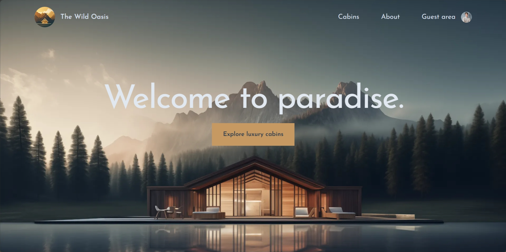
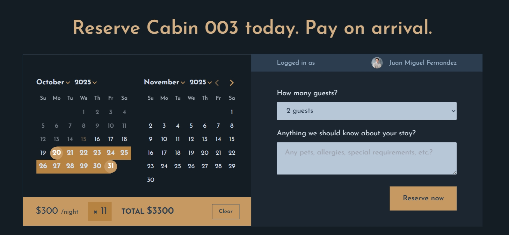

# The Wild Oasis Website

Second main project in Jonas Schmedtmann's Ultimate React Course. Customer-facing website for a hypothetical small boutique hotel that lets guests learn more about the hotel, reserve cabins, and create and update their profile. Built with React, Next.js, and Supabase.

Live Demo [here](https://the-wild-oasis-website-jmgf.vercel.app/).

## Technologies Used

- Framework - Next.js(App Router)
- Styling - Tailwind CSS
- Database - Supabase
- Authentication - NextAuth.js

## Features

- Authentication with Google account
- Reserve cabins using day picker
- Update or delete reservations
- Create or update user profiles

## Screenshots

